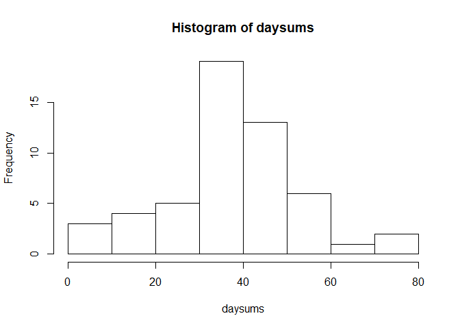
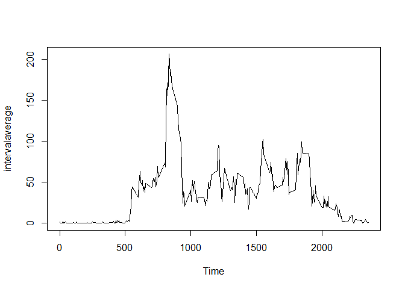
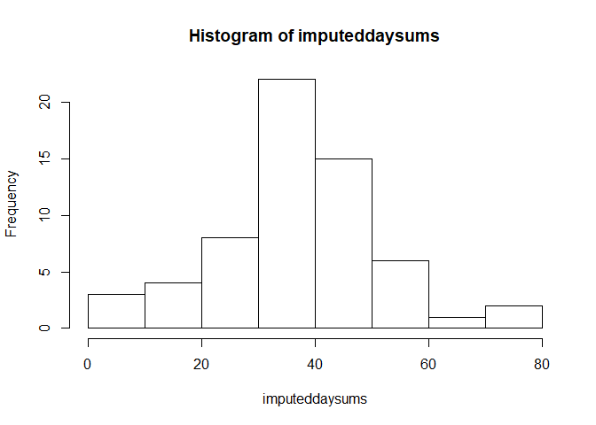
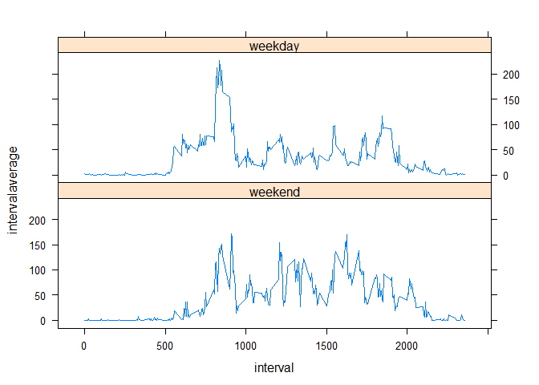

## Loading and preprocessing the data

```r
#Read in the data
activitydata<-read.csv(projectfile,colClasses = c("integer","character","integer"))

#Clean the data
activitydata$date<-as.Date(activitydata$date)
activitydata<-mutate(activitydata,weekday=wday(date))
activitydata<-arrange(activitydata,interval)
```
## What is mean total number of steps taken per day?

```r
daysums<-tapply(activitydata$steps,activitydata$date,mean,na.rm=T)
hist(daysums)
```

<!-- -->

```r
stepaverage<-mean(daysums,na.rm = T)
print(stepaverage)
```

```
## [1] 37.3826
```

## What is the average daily activity pattern?

```r
groupedactivitydata<-group_by(activitydata,interval)
groupedactivitydata<-mutate(groupedactivitydata,intervalaverage=mean(steps,na.rm = T))
with(groupedactivitydata,plot(interval,intervalaverage,xlab="Time",type="l"))
```

<!-- -->

```r
dailymax<-max(groupedactivitydata$intervalaverage)
maxrows<-which(groupedactivitydata$intervalaverage==dailymax)
maxinterval<-unique(groupedactivitydata$interval[maxrows])
print(maxinterval)
```

```
## [1] 835
```

## Imputing missing values

```r
#Using the "mice" impute function from the "mice package"
imputed_Data <- mice(groupedactivitydata, m=1, maxit = 10, method = 'pmm', seed = 500)
completeData <- complete(imputed_Data)
```

```r
imputeddaysums<-tapply(completeData$steps,completeData$date,mean)
hist(imputeddaysums)
```

<!-- -->

```r
print(summary(imputeddaysums))
```

```
##    Min. 1st Qu.  Median    Mean 3rd Qu.    Max. 
##  0.1424 30.6285 36.7049 36.9001 44.7326 73.5903
```
Comparing to the previous histogram mean, we see that imputing the NAs does not make a significant difference.  

## Are there differences in activity patterns between weekdays and weekends?

```r
completeData<-mutate(completeData,weekdaytype=factor(completeData$weekday,                                                    levels=1:7,labels=c("weekend","weekday","weekday","weekday"                                               ,"weekday","weekday","weekend")))
completeData<-group_by(completeData,weekdaytype,interval)
completeData<-mutate(completeData,intervalaverage=mean(steps,na.rm = T))
xyplot(intervalaverage~interval|weekdaytype,completeData,type="l")
```

<!-- -->
  
  
  
As we can see, weekdays have a strong spike in activity around 0830, whereas on weekends the activity is more
evenly distributed across the waking hours.
